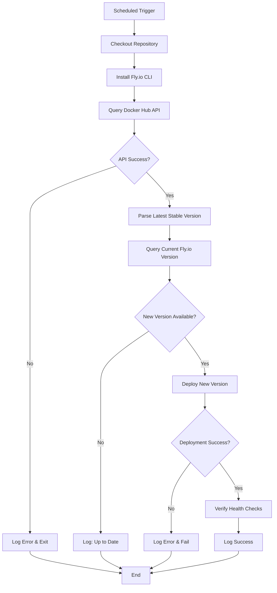

# Design Document

## Overview

This design describes an automated deployment system implemented as a GitHub Actions workflow that monitors Docker Hub for new stable n8n releases and deploys them to Fly.io. The system uses a scheduled workflow that checks for version updates, compares them against the currently deployed version, and triggers a deployment when a newer stable version is available.

## Architecture

The system consists of a single GitHub Actions workflow with the following components:

1. **Version Detection Module**: Queries Docker Hub API to fetch the latest stable n8n version
2. **Version Comparison Module**: Compares the detected version with the currently deployed version
3. **Deployment Module**: Uses Fly.io CLI to deploy the updated Docker image
4. **Notification Module**: Logs deployment status and results

The workflow follows a linear execution model:

```
Schedule Trigger → Check Docker Hub → Compare Versions → Deploy (if needed) → Report Status
```

## Components and Interfaces

### 1. GitHub Actions Workflow File

**Location**: `.github/workflows/deploy-n8n.yml`

**Triggers**:

- Schedule: Daily cron job (e.g., `0 2 * * *` for 2 AM UTC)
- Manual: `workflow_dispatch` for on-demand execution

**Environment Variables**:

- `FLY_API_TOKEN`: Stored in GitHub Secrets, used for Fly.io authentication
- `FLY_APP_NAME`: The Fly.io application name (from fly.toml)

### 2. Version Detection Module

**Implementation**: Bash script or GitHub Actions steps

**Interface**:

- Input: None
- Output: Latest stable version string (e.g., "1.23.4")

**Behavior**:

- Queries Docker Hub API endpoint: `https://hub.docker.com/v2/repositories/n8nio/n8n/tags`
- Filters tags to exclude pre-release versions (containing `-`, `beta`, `alpha`, `rc`)
- Parses semantic version tags
- Returns the highest semantic version

### 3. Version Comparison Module

**Implementation**: Bash script using semantic version comparison

**Interface**:

- Input: Latest version from Docker Hub, current deployed version
- Output: Boolean indicating if update is needed

**Behavior**:

- Retrieves current version from Fly.io deployment or stored state
- Compares versions using semantic versioning rules
- Returns true if Docker Hub version is newer

### 4. Deployment Module

**Implementation**: Fly.io CLI commands

**Interface**:

- Input: New version tag
- Output: Deployment status

**Behavior**:

- Authenticates with Fly.io using API token
- Updates the deployment to use the new Docker image
- Preserves existing configuration from fly.toml
- Waits for deployment health checks to pass

### 5. State Management

**Implementation**: GitHub repository file or Fly.io deployment metadata

**Options**:

- Option A: Store current version in a file committed to the repository
- Option B: Query Fly.io API to get currently deployed image tag
- **Recommended**: Option B (query Fly.io) to avoid repository commits and maintain single source of truth

## Data Models

### Version Information

```yaml
version:
  tag: string # e.g., "1.23.4"
  is_stable: boolean # true if no pre-release identifiers
  published_date: string # ISO 8601 timestamp
```

### Deployment Status

```yaml
deployment:
  status: string # "success" | "failed" | "skipped"
  version: string # Version that was deployed
  timestamp: string # ISO 8601 timestamp
  message: string # Status message or error details
```

## Correctness Properties

_A property is a characteristic or behavior that should hold true across all valid executions of a system—essentially, a formal statement about what the system should do. Properties serve as the bridge between human-readable specifications and machine-verifiable correctness guarantees._

### Property 1: Docker Hub API Query Returns Valid Version

_For any_ scheduled execution of the workflow, querying the Docker Hub API should return a response that can be parsed into a valid semantic version string or an error.
**Validates: Requirements 1.1**

### Property 2: Semantic Version Comparison Correctness

_For any_ pair of valid semantic version strings, the version comparison function should correctly determine which version is newer according to semantic versioning rules (major.minor.patch ordering).
**Validates: Requirements 1.2**

### Property 3: Pre-release Version Filtering

_For any_ version tag containing pre-release identifiers (such as `-beta`, `-alpha`, `-rc`, or any hyphenated suffix), the version filtering function should exclude it from the list of stable versions.
**Validates: Requirements 1.3**

### Property 4: API Error Handling

_For any_ API error response from Docker Hub, the system should log the error message and exit gracefully without crashing or triggering a deployment.
**Validates: Requirements 1.4**

### Property 5: Deployment Trigger on New Version

_For any_ case where the latest Docker Hub version is semantically greater than the current deployed version, the system should initiate a deployment to Fly.io.
**Validates: Requirements 2.1**

### Property 6: No Deployment When Versions Match

_For any_ case where the latest Docker Hub version equals the current deployed version, the system should complete without triggering a deployment.
**Validates: Requirements 2.2**

### Property 7: Deployment Uses Correct Image Tag

_For any_ deployment operation, the Fly.io CLI command should reference the correct Docker image with the new version tag.
**Validates: Requirements 2.3**

### Property 8: Latest Version Selection

_For any_ set of multiple stable versions, the system should select and deploy only the version with the highest semantic version number.
**Validates: Requirements 2.4**

### Property 9: API Token Usage

_For any_ Fly.io authentication attempt, the system should read the API token from the designated GitHub Secret environment variable.
**Validates: Requirements 3.1**

### Property 10: Authentication Failure Handling

_For any_ case where the API token is missing or invalid, the system should fail with a non-zero exit code and log an authentication error message.
**Validates: Requirements 3.2**

### Property 11: Secret Masking in Logs

_For any_ log output, sensitive credential values should not appear in plain text (GitHub Actions automatically masks secrets).
**Validates: Requirements 3.4**

### Property 12: Success Logging Includes Version

_For any_ successful deployment, the log output should contain the version number that was deployed.
**Validates: Requirements 4.1**

### Property 13: Failure Logging Includes Error Details

_For any_ failed deployment, the log output should contain error information describing what went wrong.
**Validates: Requirements 4.2**

### Property 14: Workflow Summary Completeness

_For any_ workflow execution, the final summary should include information about the version check result and any deployment actions taken.
**Validates: Requirements 4.3**

### Property 15: Complete Execution Flow

_For any_ workflow trigger (scheduled or manual), the system should execute all required steps in the correct order: version check, comparison, deployment decision, and status reporting.
**Validates: Requirements 5.2**

### Property 16: Configuration File Preservation

_For any_ deployment, the system should use the existing fly.toml configuration file without modification.
**Validates: Requirements 6.1**

### Property 17: Volume Mount Preservation

_For any_ deployment, the mounted volume configuration should remain unchanged to preserve n8n data.
**Validates: Requirements 6.2**

### Property 18: Image-Only Updates

_For any_ deployment operation, only the Docker image tag should be updated while all other configuration remains unchanged.
**Validates: Requirements 6.3**

### Property 19: Post-Deployment Health Verification

_For any_ completed deployment, the system should verify that the n8n service passes health checks and is accessible.
**Validates: Requirements 6.4**

## Error Handling

### API Errors

- Docker Hub API failures should be caught and logged
- Network timeouts should result in graceful workflow failure with retry on next schedule
- Invalid API responses should be logged with details for debugging

### Authentication Errors

- Missing FLY_API_TOKEN should fail immediately with clear error message
- Invalid tokens should be detected during Fly.io CLI authentication
- All authentication errors should prevent deployment attempts

### Deployment Errors

- Failed deployments should be logged with full error output from Fly.io CLI
- Health check failures should be reported with service status details
- Rollback is handled by Fly.io's built-in deployment safety mechanisms

### Version Parsing Errors

- Invalid version strings should be logged and skipped
- Malformed Docker Hub responses should result in workflow failure
- Version comparison errors should be logged with the problematic versions

## Testing Strategy

### Unit Testing

The workflow logic will be tested using a combination of:

1. **Shell Script Unit Tests**: Using a framework like `bats` (Bash Automated Testing System) to test individual functions:

   - Version parsing and filtering logic
   - Semantic version comparison
   - Error handling paths

2. **Mock Testing**: Testing workflow behavior with mocked external services:

   - Mock Docker Hub API responses
   - Mock Fly.io CLI commands
   - Test various success and failure scenarios

3. **Integration Tests**: Testing the complete workflow in a test environment:
   - Test deployment to a staging Fly.io app
   - Verify version detection and comparison
   - Validate error handling with intentional failures

### Property-Based Testing

Property-based testing will be implemented using `bats` with generated test cases:

**Testing Framework**: Bash Automated Testing System (bats-core)

**Test Configuration**: Each property test should run with at least 100 randomly generated test cases where applicable.

**Property Test Implementation**:

- Generate random semantic version strings for comparison tests
- Generate various pre-release tag formats for filtering tests
- Test error handling with different failure scenarios
- Verify logging output contains expected information

Each property-based test will be tagged with a comment referencing the design document property:

```bash
# Feature: n8n-auto-deploy, Property 2: Semantic Version Comparison Correctness
```

### Test Coverage Goals

- 100% coverage of version comparison logic
- 100% coverage of error handling paths
- Integration test for complete deployment flow
- Property tests for all version filtering and comparison operations

### Manual Testing Checklist

Before production deployment:

1. Verify GitHub Secret (FLY_API_TOKEN) is configured
2. Test manual workflow trigger
3. Verify scheduled trigger configuration
4. Test with current version (should skip deployment)
5. Test with older version (should trigger deployment)
6. Verify logs contain appropriate information
7. Confirm n8n service remains accessible after deployment

## Implementation Notes

### GitHub Actions Best Practices

1. **Concurrency Control**: Use `concurrency` key to prevent simultaneous deployments
2. **Timeout Configuration**: Set reasonable timeouts for each step
3. **Secret Handling**: Use `${{ secrets.FLY_API_TOKEN }}` syntax, never echo secrets
4. **Step Naming**: Use clear, descriptive names for each workflow step
5. **Conditional Execution**: Use `if` conditions to skip deployment when not needed

### Fly.io Deployment Strategy

The deployment will use `flyctl deploy` with the following approach:

- Specify the image directly: `flyctl deploy --image n8nio/n8n:${VERSION}`
- Use existing fly.toml for all configuration
- Let Fly.io handle health checks and rollback if needed
- Wait for deployment completion before marking workflow as successful

### Version Detection Strategy

Docker Hub API endpoint: `GET https://hub.docker.com/v2/repositories/n8nio/n8n/tags?page_size=100`

Response parsing:

1. Extract all tag names from the results
2. Filter out tags containing `-` (pre-releases)
3. Filter out non-semantic version tags (like `latest`, `next`)
4. Sort remaining versions using semantic version comparison
5. Return the highest version

### State Management Decision

The system will query Fly.io to determine the currently deployed version rather than maintaining state in the repository. This approach:

- Avoids unnecessary repository commits
- Maintains single source of truth (Fly.io deployment)
- Simplifies the workflow logic
- Handles manual deployments correctly

Command to get current version: `flyctl status --json | jq -r '.Image'`

## Security Considerations

1. **API Token Storage**: FLY_API_TOKEN must be stored as a GitHub Secret
2. **Token Permissions**: Token should have minimal permissions (deploy access only)
3. **Log Sanitization**: GitHub Actions automatically masks secrets in logs
4. **Dependency Security**: Use official Fly.io CLI installation methods
5. **Workflow Permissions**: Limit workflow permissions to minimum required

## Deployment Workflow



## Future Enhancements

Potential improvements for future iterations:

1. Slack/Discord notifications for deployment events
2. Automatic rollback on health check failures
3. Support for deploying specific version tags via workflow input
4. Deployment approval workflow for production environments
5. Metrics collection for deployment success rates
6. Support for canary deployments or blue-green strategies
